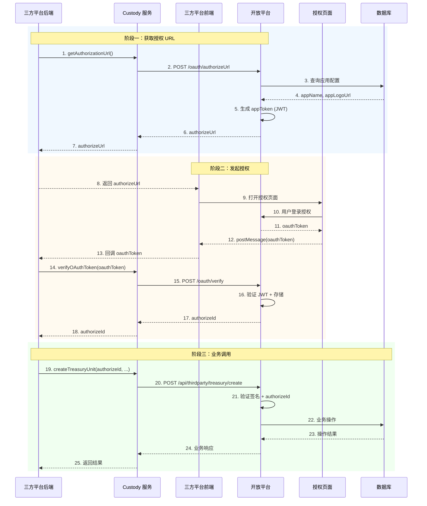
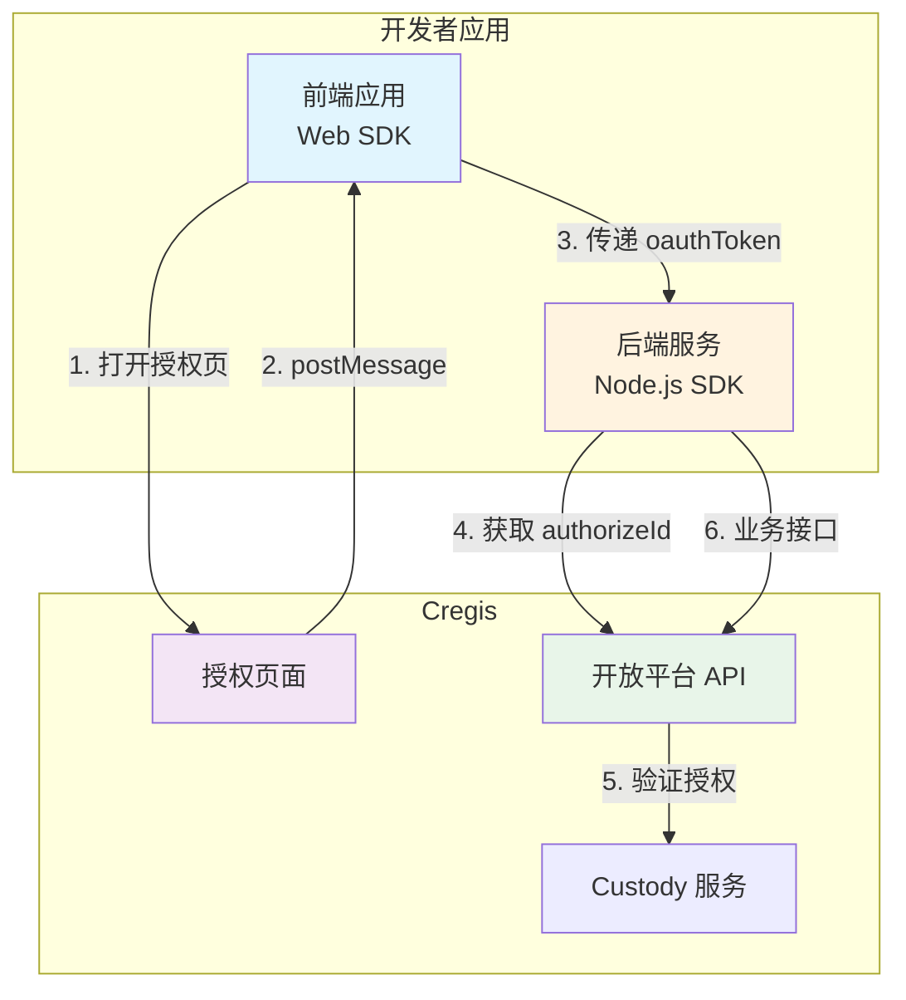
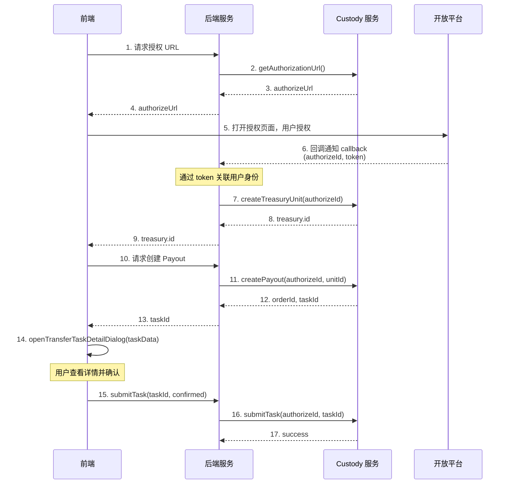

# 第三方开发者接入指南

**Last Updated:** 2026-04-13
**版本:** v3.0

---

## 概述

本文档描述第三方开发者如何接入开放平台，包含授权流程和接口对接规范。

---

## 接入流程

### 整体交互流程



### 接入流程说明

| 阶段 | 说明 |
|------|------|
| 获取授权 URL | 三方平台后端调用 Custody 服务 `getAuthorizationUrl` 接口，Custody 服务内部调用开放平台 `/oauth/authorizeUrl` 获取授权页面 URL |
| 发起授权 | 三方平台前端打开授权页面 → 用户登录授权 → 授权页面通过 postMessage 返回 oauthToken → 三方平台后端用 oauthToken 调用 Custody 服务 `verifyOAuthToken` 接口换取 authorizeId |
| 业务调用 | 三方平台后端通过 Custody 服务调用开放平台业务接口（使用 authorizeId） |

---

## 一、授权接口

### 1.1 获取授权 URL

用于第三方平台获取授权页面 URL。

**请求**

```
POST /api/thirdparty/oauth/authorizeUrl
Content-Type: application/json
```

**请求体**

```json
{
  "basic": {
    "appId": "550e8400-e29b-41d4-a716-446655440000",
    "timestamp": 1742947200,
    "nonce": "abc123def456",
    "signature": "md5-hash-signature"
  },
  "business": {
    "permissions": ["read", "write"],
    "state": "custom-state",
    "callback": "https://your-app.com/callback",
    "token": "developer-generated-token-xyz"
  }
}
```

| 参数 | 类型 | 必填 | 说明 |
|------|------|------|------|
| permissions | string[] | 是 | 权限列表 |
| state | string | 是 | 防 CSRF 状态 |
| callback | string | 否 | 授权成功后的回调通知地址 |
| token | string | 否 | 开发者生成的 token，用于回调时身份映射 |

**响应**

```json
{
  "code": 0,
  "message": "Success",
  "data": {
    "authorizeUrl": "https://openplatform.cregis.com/openplatform/auth/authorize?appId=xxx&appToken=yyy&appName=zzz&permissions=...&state=...",
    "expiresIn": 7200
  }
}
```

**URL 参数说明**

| 参数 | 来源 | 说明 |
|------|------|------|
| appId | 请求传入 | 应用标识 |
| appToken | 后端生成 | JWT token (内含 appId + callback + token) |
| appName | 平台配置 | 应用名称（不可伪造） |
| permissions | 请求 + 平台校验 | 权限列表 |
| state | 请求传入 | 防 CSRF 状态 |

---

### 1.2 验证授权并存储

用于 Custody 服务验证 Token 并存储授权信息。**此接口由 Custody 服务在用户授权完成后内部调用**，无需第三方开发者直接调用。

> 注意：此接口**无需签名认证**，由 Custody 服务内部使用。

**请求**

```
POST /api/thirdparty/oauth/verify
Content-Type: application/json
```

**请求体**

```json
{
  "resourceKey": "treasury_unit_123",
  "oauthToken": "eyJhbGciOiJIUzI1NiIsInR5cCI6IkpXVCJ9..."
}
```

| 参数 | 类型 | 必填 | 说明 |
|------|------|------|------|
| resourceKey | string | 是 | 资源标识（如财务单元 ID） |
| oauthToken | string | 是 | OAuth 授权 token（JWT 格式，内含 callback 和 token） |

**回调通知**

验证成功后，开放平台会根据 JWT 中的 callback 参数或应用的默认回调地址发送通知：

```json
{
  "authorizeId": "uuid-authorization-id",
  "token": "developer-generated-token-xyz"
}
```

| 参数 | 类型 | 说明 |
|------|------|------|
| authorizeId | string | 授权记录 ID，用于后续业务接口的 authorizationId |
| token | string | 开发者提供的身份映射 token（用于关联开发者系统的用户身份） |

**响应**

```json
{
  "code": 0,
  "message": "Success",
  "data": {
    "authorizeId": "uuid-authorization-id"
  }
}
```

| 参数 | 类型 | 说明 |
|------|------|------|
| authorizeId | string | 授权记录 ID，用于后续业务接口的 authorizationId |

---

## 二、签名算法

### 2.1 签名类型

开放平台使用两种签名算法：

| 签名类型 | 适用接口 | 签名字符串 |
|----------|----------|------------|
| **Basic 签名** | `/oauth/*` | `appId + timestamp + nonce + md5(business)` |
| **Resource 签名** | `/third-party/*` | `appId + authorizationId + timestamp + nonce + md5(business)` |

### 2.2 Basic 签名计算步骤

适用于 `/oauth/*` 接口。

```
1. 对 business JSON 按 key 排序后序列化:
   JSON.stringify(sortKeys(business))

2. 计算 business 的 MD5:
   md5 = MD5(序列化后的 JSON)

3. 拼接签名字符串:
   signString = appId + timestamp + nonce + md5(business)

4. 使用 appSecret 签名:
   signature = MD5(appSecret + signString)

5. 将签名结果放入 basic.signature 字段
```

**公式：**
```
signature = MD5(appSecret + appId + timestamp + nonce + MD5(JSON.stringify(sortKeys(business))))
```

### 2.3 Resource 签名计算步骤

适用于 `/third-party/*` 接口。

```
1. 对 business JSON 按 key 排序后序列化:
   JSON.stringify(sortKeys(business))

2. 计算 business 的 MD5:
   md5 = MD5(序列化后的 JSON)

3. 拼接签名字符串:
   signString = appId + authorizationId + timestamp + nonce + md5(business)

4. 使用 appSecret 签名:
   signature = MD5(appSecret + signString)

5. 将签名结果放入 basic.signature 字段
```

**公式：**
```
signature = MD5(appSecret + appId + authorizationId + timestamp + nonce + MD5(JSON.stringify(sortKeys(business))))
```

### 2.4 签名示例 (Basic 签名)

假设：

- `appId` = `550e8400-e29b-41d4-a716-446655440000`
- `appSecret` = `secret123`
- `timestamp` = `1742947200`
- `nonce` = `abc123def456`
- `business` = `{"permissions":["read","write"],"state":"custom-state","callback":"https://example.com/callback","token":"xyz123"}`

计算过程：

```javascript
// 1. business JSON (已排序)
businessJson = '{"permissions":["read","write"],"state":"custom-state","callback":"https://example.com/callback","token":"xyz123"}'

// 2. business MD5
businessMd5 = MD5('{"permissions":["read","write"],"state":"custom-state","callback":"https://example.com/callback","token":"xyz123"}')

// 3. 签名字符串 (Basic 签名不包含 authorizationId)
signString = "550e8400-e29b-41d4-a716-446655440000" +
             "1742947200" +
             "abc123def456" +
             businessMd5

// 4. 最终签名
signature = MD5("secret123" + signString)
```

### 2.5 签名验证规则

- **时间戳容差**: 5 分钟（300 秒）
- **Nonce TTL**: 1 小时（3600 秒），防重放
- **appId 格式**: 必须是有效的 UUID
- **authorizationId 格式**: 必须是有效的 UUID（Resource 签名）

### 2.6 请求认证结构

开放平台 API 将开发者请求分为两类，分别使用不同的认证结构：

#### BasicInfo - 基础认证结构

用于不涉及资源操作的接口（如 OAuth 接口）：

| 接口 | 用途 |
|------|------|
| `POST /oauth/token` | 获取访问令牌 |
| `POST /oauth/authorizeUrl` | 获取授权 URL |
| `POST /oauth/verify` | 验证 OAuth Token |

**结构定义：**

```json
{
  "basic": {
    "appId": "550e8400-e29b-41d4-a716-446655440000",
    "timestamp": 1742947200,
    "nonce": "abc123def456",
    "signature": "a1b2c3d4e5f6a1b2c3d4e5f6a1b2c3d4"
  }
}
```

| 字段 | 类型 | 必填 | 说明 |
|------|------|------|------|
| appId | string | 是 | 应用标识，必须是有效的 UUID 格式 |
| timestamp | number | 是 | Unix 时间戳（秒），必须在当前时间 ±5 分钟内 |
| nonce | string | 是 | 随机字符串，用于防重放，不可为空 |
| signature | string | 是 | MD5 签名，32 位十六进制字符串 |

#### BasicInfoWithAuthorization - 资源认证结构

用于涉及资源操作的接口（所有 `/third-party/*` 接口）：

**结构定义：**

```json
{
  "basic": {
    "appId": "550e8400-e29b-41d4-a716-446655440000",
    "timestamp": 1742947200,
    "nonce": "abc123def456",
    "signature": "a1b2c3d4e5f6a1b2c3d4e5f6a1b2c3d4",
    "authorizationId": "123e4567-e89b-12d3-a456-426614174000"
  }
}
```

| 字段 | 类型 | 必填 | 说明 |
|------|------|------|------|
| appId | string | 是 | 应用标识，必须是有效的 UUID 格式 |
| timestamp | number | 是 | Unix 时间戳（秒），必须在当前时间 ±5 分钟内 |
| nonce | string | 是 | 随机字符串，用于防重放，不可为空 |
| signature | string | 是 | MD5 签名，32 位十六进制字符串 |
| authorizationId | string | 是 | 授权标识，必须是有效的 UUID 格式，用于绑定签名与特定授权资源 |

**authorizationId 说明：**

- 开发者发起资源操作前，需要先通过 OAuth 流程获取授权
- 授权成功后，开放平台会返回 `authorizeId`（即 authorizationId）
- 签名与 authorizationId 绑定，防止签名被用于其他授权资源

#### 验证器使用说明

服务端使用继承模式的验证器：

```
BasicValidator          → 验证 BasicInfo（OAuth 接口）
└─ ResourceValidator   → 验证 BasicInfoWithAuthorization（资源操作接口）
```

| 验证器 | 验证字段 | 适用接口 |
|--------|---------|---------|
| BasicValidator | appId, timestamp, nonce, signature | /oauth/* |
| ResourceValidator | BasicInfo + authorizationId | /third-party/* |

---

## 三、财务单元管理接口

### 3.1 接口列表 (Third-Party Treasury Unit Management)

| 方法 | 路径 | 说明 |
|------|------|------|
| POST | /api/thirdparty/treasury/create | 创建财务单元 |
| POST | /api/thirdparty/treasury/list | 查询财务单元列表 |
| POST | /api/thirdparty/treasury/address | 获取财务单元地址 |
| POST | /api/thirdparty/treasury/payout | 出金操作 |
| POST | /api/thirdparty/treasury/submit-task/{taskId} | 提交任务审批 |
| POST | /api/thirdparty/treasury/activities | 查询活动记录 |
| POST | /api/thirdparty/treasury/transfer-out-orders | 查询出金订单 |
| POST | /api/thirdparty/treasury/transfer-in-orders | 查询入金订单 |
| POST | /api/thirdparty/treasury/fund-records | 查询资金流水 |

### 3.2 通用请求格式

所有接口请求格式统一包含 `basic` 和 `business` 两部分：

```json
{
  "basic": {
    "appId": "550e8400-e29b-41d4-a716-446655440000",
    "authorizationId": "123e4567-e89b-12d3-a456-426614174000",
    "timestamp": 1742947200,
    "nonce": "random-string",
    "signature": "md5-hash"
  },
  "business": {
    // 业务数据
  }
}
```

### 3.3 财务单元管理接口详情

#### 3.3.1 创建财务单元

**POST** `/api/thirdparty/treasury/create`

创建新的财务单元。

> Body Parameters

```json
{
  "businessScope": "DEDICATED_ACCOUNT",
  "topology": "ORBIT",
  "coinIds": [{"coinId": "USDT", "network": "TRC20"}],
  "primaryManager": [{"coinId": "USDT", "fundControlRules": [{"guardians": ["user@email.com"], "threshold": "1", "perTransferLimit": "1000", "dailyTransferLimit": "50000"}]}],
  "payoutManager": [{"coinId": "USDT", "fundControlRules": [{"guardians": ["user@email.com"], "threshold": "1", "perTransferLimit": "1000", "dailyTransferLimit": "50000"}]}],
  "riskManager": [{"coinId": "USDT", "fundControlRules": [{"guardians": ["user@email.com"], "threshold": "1", "perTransferLimit": "1000", "dailyTransferLimit": "50000"]]}]
}
```

| 参数 | 类型 | 必填 | 说明 |
|------|------|------|------|
| businessScope | string | 是 | 业务类型：`DEDICATED_ACCOUNT`(专属账户) / `OMNIBUS_ACCOUNT`( Omnibus账户) / `OPEN_API_PROXY`(开放API代理) |
| topology | string | 是 | 账本拓扑结构：`ORBIT` / `SINGLE_GENERAL` / `QUAD_SMART_ISOLATION` |
| coinIds | array | 是 | 币种信息列表 |
| primaryManager | array | 是 | 资金管理员配置 |
| payoutManager | array | 是 | 出金管理员配置 |
| riskManager | array | 是 | 风控管理员配置 |

**coinIds 子参数说明**

| 参数 | 类型 | 必填 | 说明 |
|------|------|------|------|
| coinId | string | 是 | 币种 ID，如 `USDT`、`BTC`、`ETH` |
| network | string | 是 | 网络类型，如 `TRC20`、`ERC20`、`BEP20` |

**manager 配置子参数说明 (primaryManager / payoutManager / riskManager)**

每个 manager 配置包含以下字段：

| 参数 | 类型 | 必填 | 说明 |
|------|------|------|------|
| coinId | string | 是 | 币种 ID |
| fundControlRules | array | 是 | 资金控制规则列表 |

**fundControlRules 子参数说明**

| 参数 | 类型 | 必填 | 说明 |
|------|------|------|------|
| guardians | array | 是 | 守护人邮箱列表，用于多签审批 |
| threshold | string | 是 | 审批阈值，需要多少位守护人同意才能执行 |
| perTransferLimit | string | 是 | 单笔转账限额，超过此金额需要多签审批 |
| dailyTransferLimit | string | 是 | 每日转账限额，超过此金额需要多签审批 |

**fundControlRules 配置示例**

```json
{
  "coinId": "USDT",
  "fundControlRules": [
    {
      "guardians": ["admin@company.com", "security@company.com"],
      "threshold": "2",
      "perTransferLimit": "1000",
      "dailyTransferLimit": "50000"
    }
  ]
}
```

**响应示例**

```json
{
  "code": 0,
  "message": "Success",
  "data": {
    "id": 1,
    "name": "My Treasury Unit",
    "ecode": "TU-20260413001",
    "vaultCode": "VLT-xxx",
    "groupCode": "GRP-xxx",
    "custodialBusinessScope": "DEDICATED_ACCOUNT",
    "networks": ["TRC20"],
    "status": "ACTIVATED",
    "caaFactoryAddresses": [
      {"network": "TRC20", "address": "0x..."}
    ],
    "factoryStatus": 3,
    "createTime": "2026-04-13T10:00:00Z"
  }
}
```

#### 3.3.2 查询财务单元列表

**POST** `/api/thirdparty/treasury/list`

查询当前商户下所有财务单元。

> Body Parameters

```json
{
  "pageSize": 10,
  "pageNum": 1,
  "sortFields": "createTime_d"
}
```

| 参数 | 类型 | 必填 | 说明 |
|------|------|------|------|
| pageSize | integer | 否 | 每页数量，默认 10 |
| pageNum | integer | 否 | 页码，默认 1 |
| sortFields | string | 否 | 排序字段，格式：`字段名_asc/desc`，如 `createTime_d` 表示按创建时间降序 |

**响应示例**

```json
{
  "code": 0,
  "message": "Success",
  "data": [
    {
      "id": 1,
      "ecode": "TU-20260413001",
      "projectId": 100,
      "name": "My Treasury Unit",
      "custodyServiceMode": "DEDICATED_ACCOUNT",
      "coinIds": [{"coinId": "USDT", "network": "TRC20"}],
      "accounts": [
        {"account_name": "PRIMARY", "account_type": "PRIMARY"},
        {"account_name": "PAYOUT", "account_type": "PAYOUT"},
        {"account_name": "QUARANTINE", "account_type": "QUARANTINE"}
      ],
      "status": "Active",
      "creationType": "THIRD_PARTY",
      "createTime": "2026-04-13T10:00:00Z"
    }
  ]
}
```

#### 3.3.3 获取财务单元地址

**POST** `/api/thirdparty/treasury/address`

获取财务单元下指定账户类型的地址列表。

> Body Parameters

```json
{
  "accountType": "PRIMARY",
  "pageSize": 10,
  "pageNum": 1,
  "coinId": "USDT",
  "network": "TRC20",
  "unitId": 1
}
```

| 参数 | 类型 | 必填 | 说明 |
|------|------|------|------|
| unitId | integer | 是 | 财务单元ID |
| accountType | string | 否 | 账户类型：`PRIMARY` / `PAYIN` / `PAYOUT` / `QUARANTINE` / `RECEIVABLE` 等 |
| coinId | string | 否 | 币种ID |
| network | string | 否 | 网络 |
| pageSize | integer | 否 | 每页数量 |
| pageNum | integer | 否 | 页码 |

#### 3.3.4 出金操作

**POST** `/api/thirdparty/treasury/payout`

发起出金操作。

> Body Parameters

```json
{
  "payTo": [{"to": "0x...", "amount": "100"}],
  "unitId": 1,
  "coinId": "USDT",
  "network": "TRC20",
  "operation": "withdraw",
  "userId": "user-123",
  "orderId": "ORDER-20260413001",
  "note": "Payment for order #12345",
  "merchantType": "NON_FINANCIAL_CORPORATE",
  "travelRule": {
    "referenceId": "TR-REF-001",
    "payload": "{}"
  }
}
```

| 参数 | 类型 | 必填 | 说明 |
|------|------|------|------|
| unitId | integer | 是 | 财务单元ID |
| payTo | array | 是 | 出金地址列表 |
| coinId | string | 是 | 币种ID |
| network | string | 是 | 网络 |
| operation | string | 否 | 操作类型：`withdraw` / `allocate` / `payout` |
| orderId | string | 否 | 客户业务订单ID |
| userId | string | 否 | 发起用户ID |
| note | string | 否 | 备注 |
| merchantType | string | 是 | 商户类型 |
| travelRule | object | 否 | Travel Rule 信息 |

#### 3.3.5 提交任务审批

**POST** `/api/thirdparty/treasury/submit-task/{taskId}`

提交任务审批（签名）。

> Body Parameters

```json
{
  "signatures": {"taskId-1": ["sig1", "sig2"]},
  "confirmed": true
}
```

| 参数 | 类型 | 必填 | 说明 |
|------|------|------|------|
| signatures | object | 否 | 签名结果，key为taskId，value为签名字符串列表 |
| confirmed | boolean | 是 | 操作确认：`true`同意 / `false`拒绝 |

#### 3.3.6 查询活动记录

**POST** `/api/thirdparty/treasury/activities`

分页查询活动记录，包括所有资金操作如入金、出金、转账等。

> Body Parameters

```json
{
  "pageIndex": 0,
  "pageSize": 20,
  "sortFields": "createTime_d",
  "queryList": [
    {"key": "unitId", "value": 1, "oper": "=", "join": "and"},
    {"key": "coinId", "value": "USDT", "oper": "=", "join": "and"},
    {"key": "type", "value": "TRANSFER_OUT", "oper": "=", "join": "and"}
  ]
}
```

| 参数 | 类型 | 必填 | 说明 |
|------|------|------|------|
| pageIndex | integer | 否 | 页码索引，从 0 开始，默认 0 |
| pageSize | integer | 否 | 每页数量，默认 20 |
| sortFields | string | 否 | 排序字段，格式：`字段名_asc/desc` |
| queryList | array | 否 | 查询条件列表 |
| queryList[].key | string | 否 | 查询字段名，可选值：`unitId` / `coinId` / `type` / `status` / `direction` |
| queryList[].value | string/number | 否 | 查询值 |
| queryList[].oper | string | 否 | 操作符：`=` / `!=` / `>` / `<` / `like` |
| queryList[].join | string | 否 | 连接方式：`and` / `or` |

**响应示例**

```json
{
  "code": 0,
  "message": "Success",
  "data": {
    "records": [
      {
        "id": 1,
        "ecode": "TU-20260413001",
        "treasuryUnitId": 1,
        "accountType": "PRIMARY",
        "coinId": "USDT",
        "network": "TRC20",
        "type": "TRANSFER_OUT",
        "amount": "100",
        "direction": "OUT",
        "orderId": "ORDER-001",
        "status": "SUCCEED",
        "travelRuleStatus": "NOT_REQUIRED",
        "kytStatus": "NOT_REQUIRED",
        "createTime": "2026-04-13T10:00:00Z"
      }
    ],
    "total": 100,
    "size": 20,
    "current": 1
  }
}
```

#### 3.3.7 查询出金订单

**POST** `/api/thirdparty/treasury/transfer-out-orders`

分页查询出金订单，包括提现和调拨订单。

> Body Parameters

```json
{
  "pageIndex": 0,
  "pageSize": 20,
  "sortFields": "createTime_d",
  "queryList": [
    {"key": "unitId", "value": 1, "oper": "=", "join": "and"},
    {"key": "coinId", "value": "USDT", "oper": "=", "join": "and"}
  ]
}
```

| 参数 | 类型 | 必填 | 说明 |
|------|------|------|------|
| pageIndex | integer | 否 | 页码索引，从 0 开始，默认 0 |
| pageSize | integer | 否 | 每页数量，默认 20 |
| sortFields | string | 否 | 排序字段，格式：`字段名_asc/desc` |
| queryList | array | 否 | 查询条件列表 |
| queryList[].key | string | 否 | 查询字段名 |
| queryList[].value | string/number | 否 | 查询值 |
| queryList[].oper | string | 否 | 操作符：`=` / `!=` / `>` / `<` / `like` |
| queryList[].join | string | 否 | 连接方式：`and` / `or` |

**响应示例**

```json
{
  "code": 0,
  "message": "Success",
  "data": {
    "records": [
      {
        "orderId": "ORDER-001",
        "txId": "0x...",
        "coinId": "USDT",
        "network": "TRC20",
        "totalAmount": 100,
        "fee": "1",
        "orderState": "SUCCEED",
        "payToList": [{"to": "0x...", "amount": "100"}],
        "businessId": "EXT-001",
        "createTime": "2026-04-13T10:00:00Z"
      }
    ],
    "total": 50,
    "size": 20,
    "current": 1
  }
}
```

#### 3.3.8 查询入金订单

**POST** `/api/thirdparty/treasury/transfer-in-orders`

分页查询入金订单，包括充值和收款订单。

> Body Parameters

```json
{
  "pageIndex": 0,
  "pageSize": 20,
  "sortFields": "createTime_d",
  "queryList": [
    {"key": "unitId", "value": 1, "oper": "=", "join": "and"}
  ]
}
```

| 参数 | 类型 | 必填 | 说明 |
|------|------|------|------|
| pageIndex | integer | 否 | 页码索引，从 0 开始，默认 0 |
| pageSize | integer | 否 | 每页数量，默认 20 |
| sortFields | string | 否 | 排序字段，格式：`字段名_asc/desc` |
| queryList | array | 否 | 查询条件列表 |
| queryList[].key | string | 否 | 查询字段名 |
| queryList[].value | string/number | 否 | 查询值 |
| queryList[].oper | string | 否 | 操作符：`=` / `!=` / `>` / `<` / `like` |
| queryList[].join | string | 否 | 连接方式：`and` / `or` |

**响应示例**

```json
{
  "code": 0,
  "message": "Success",
  "data": {
    "records": [
      {
        "orderId": "ORDER-002",
        "txId": "0x...",
        "cpAddress": "0x...",
        "amount": "500",
        "coinId": "USDT",
        "network": "TRC20",
        "orderState": "SUCCEED",
        "type": 1,
        "initiator": 1,
        "createTime": "2026-04-13T10:00:00Z"
      }
    ],
    "total": 30,
    "size": 20,
    "current": 1
  }
}
```

#### 3.3.9 查询资金流水

**POST** `/api/thirdparty/treasury/fund-records`

分页查询资金流水，记录每笔资金变动明细。

> Body Parameters

```json
{
  "pageIndex": 0,
  "pageSize": 20,
  "sortFields": "createTime_d",
  "queryList": [
    {"key": "unitId", "value": 1, "oper": "=", "join": "and"},
    {"key": "coinId", "value": "USDT", "oper": "=", "join": "and"},
    {"key": "txType", "value": "TRANSFER_OUT", "oper": "=", "join": "and"}
  ]
}
```

| 参数 | 类型 | 必填 | 说明 |
|------|------|------|------|
| pageIndex | integer | 否 | 页码索引，从 0 开始，默认 0 |
| pageSize | integer | 否 | 每页数量，默认 20 |
| sortFields | string | 否 | 排序字段，格式：`字段名_asc/desc` |
| queryList | array | 否 | 查询条件列表 |
| queryList[].key | string | 否 | 查询字段名，可选值：`unitId` / `coinId` / `network` / `txType` / `accountType` |
| queryList[].value | string/number | 否 | 查询值 |
| queryList[].oper | string | 否 | 操作符：`=` / `!=` / `>` / `<` / `like` |
| queryList[].join | string | 否 | 连接方式：`and` / `or` |

**响应示例**

```json
{
  "code": 0,
  "message": "Success",
  "data": {
    "records": [
      {
        "id": 1,
        "txId": "0x...",
        "coinId": "USDT",
        "network": "TRC20",
        "amount": "100",
        "preBalance": "1000",
        "postBalance": "900",
        "fee": "1",
        "txType": "TRANSFER_OUT",
        "createTime": "2026-04-13T10:00:00Z"
      }
    ],
    "total": 200,
    "size": 20,
    "current": 1
  }
}
```

**txType 枚举值**

| 值 | 说明 |
|---|---|
| TRANSFER_IN | 转入 |
| TRANSFER_OUT | 转出 |
| ALLOCATE_IN | 调拨转入 |
| ALLOCATE_OUT | 调拨转出 |
| POOL_IN | 归集转入 |
| POOL_OUT | 归集转出 |
| GAS_OUT | Gas消耗 |
| FEE_OUT | 手续费 |

---

## 四、错误码

| 错误码 | HTTP状态 | 说明 |
|--------|----------|------|
| 40101 | 401 | 签名验证失败 |
| 40102 | 401 | 时间戳超出容差范围 |
| 40103 | 401 | Nonce 已使用（重放攻击） |
| 40104 | 401 | 缺少必填字段 |
| 40105 | 401 | 应用不存在 |
| 40106 | 401 | 应用未激活 |
| 40107 | 401 | 三方平台账户未激活 |

### 4.2 授权错误

| 错误码 | HTTP状态 | 说明 |
|--------|----------|------|
| 40301 | 403 | 资源未授权 |
| 40901 | 409 | 授权已存在 |

### 4.3 业务错误

| 错误码 | HTTP状态 | 说明 |
|--------|----------|------|
| 40001 | 400 | 缺少必填参数 |
| 40002 | 400 | 参数格式错误 |
| 40401 | 404 | 资源不存在 |
| 42901 | 429 | 请求过于频繁 |
| 50001 | 500 | 服务器内部错误 |

---

## 五、SDK 示例

### 5.1 签名计算

```typescript
import crypto from 'crypto';

/**
 * Basic 签名算法 - 用于 OAuth 接口
 *
 * 适用接口：/oauth/token, /oauth/authorizeUrl, /oauth/verify
 * 公式：signature = MD5(appSecret + appId + timestamp + nonce + MD5(JSON.stringify(sortKeys(business))))
 */
function sortKeys(obj: Record<string, unknown>): Record<string, unknown> {
  if (obj === null || typeof obj !== 'object') return obj;
  if (Array.isArray(obj)) return obj.map(sortKeys) as unknown as Record<string, unknown>;

  return Object.keys(obj).sort().reduce((result, key) => {
    result[key] = sortKeys((obj as Record<string, unknown>)[key] as Record<string, unknown>);
    return result;
  }, {} as Record<string, unknown>);
}

function calculateBasicSignature(
  appId: string,
  appSecret: string,
  timestamp: number,
  nonce: string,
  business: Record<string, unknown>
): string {
  // 1. Sort and stringify business
  const sortedBusiness = sortKeys(business);
  const businessJson = JSON.stringify(sortedBusiness);

  // 2. Business MD5
  const businessMd5 = crypto.createHash('md5').update(businessJson).digest('hex');

  // 3. Build sign string (Basic: 不包含 authorizationId)
  const signString = appId + timestamp + nonce + businessMd5;

  // 4. Final signature
  return crypto.createHash('md5').update(appSecret + signString).digest('hex');
}

// Usage for OAuth endpoints
const appId = '550e8400-e29b-41d4-a716-446655440000';
const appSecret = 'secret123';
const timestamp = Math.floor(Date.now() / 1000);
const nonce = crypto.randomUUID();
const business = {
  permissions: ['read', 'write'],
  state: 'custom-state',
  callback: 'https://example.com/callback',
  token: 'xyz123'
};

const signature = calculateBasicSignature(
  appId, appSecret, timestamp, nonce, business
);
```

### 5.2 获取授权 URL 并打开授权页面

```typescript
// 1. 后端：获取授权 URL
async function getAuthorizeUrl(
  appId: string,
  appSecret: string,
  permissions: string[],
  state: string,
  callback?: string,
  token?: string
): Promise<string> {
  const timestamp = Math.floor(Date.now() / 1000);
  const nonce = crypto.randomUUID();
  const business: Record<string, unknown> = { permissions, state };
  if (callback) business.callback = callback;
  if (token) business.token = token;

  // 使用 Basic 签名（OAuth 接口不需要 authorizationId）
  const signature = calculateBasicSignature(
    appId, appSecret, timestamp, nonce, business
  );

  const response = await fetch('/api/thirdparty/oauth/authorizeUrl', {
    method: 'POST',
    headers: { 'Content-Type': 'application/json' },
    body: JSON.stringify({
      basic: { appId, timestamp, nonce, signature },
      business
    })
  });

  const result = await response.json();
  if (result.code !== 0) {
    throw new Error(result.message);
  }

  return result.data.authorizeUrl;
}

// 2. 前端：使用 SDK 打开授权页面
import { CregisWebSDK } from '@cregis-kit/openplatform-webkit';

const sdk = new CregisWebSDK({
  appId: 'your-app-id',
  container: document.getElementById('auth-container'),
  authUrl: 'https://openplatform.cregis.com/openplatform/auth/authorize',
  mode: 'popup', // popup | tab | window

  // 事件回调
  onReady: ({ uuid }) => {
    console.log('授权页面已就绪, UUID:', uuid);
  },

  onAuthorizationStarted: () => {
    console.log('用户点击了授权按钮');
  },

  onAuthorizationComplete: ({ authorizeId }) => {
    console.log('授权成功, authorizeId:', authorizeId);
  },

  onAuthorizationError: ({ code, message }) => {
    console.error('授权失败:', code, message);
  },

  onAuthorizationCancelled: () => {
    console.log('用户取消授权');
  },
});

async function authorize() {
  // 获取授权 URL（从后端）
  const authorizeUrl = await getAuthorizeUrl(
    'your-app-id',
    'your-app-secret',
    ['read', 'write'],
    'https://yourapp.com/callback',
    'custom-state'
  );

  // 使用 SDK 打开授权页面
  // mode: 'popup' (默认) - iframe 弹窗
  // mode: 'tab' - 新开浏览器标签页
  // mode: 'window' - 浏览器弹窗
  const result = await sdk.openAuthorization(authorizeUrl);

  if (result.status === 'success') {
    console.log('授权成功, authorizeId:', result.authorizeId);
  } else if (result.status === 'cancelled') {
    console.log('用户取消授权');
  } else {
    console.error('授权失败:', result.error);
  }
}
```

### 5.3 打开模式说明

| 模式 | 说明 | 通信方式 |
|------|------|----------|
| `popup` | 在 iframe 弹窗中打开授权页面 | postMessage |
| `tab` | 在新浏览器标签页中打开 | window.opener.postMessage |
| `window` | 在新浏览器窗口中打开 | window.opener.postMessage |

### 5.4 安全机制

SDK 使用 UUID 机制防止跨域消息污染：

1. SDK 初始化时生成唯一 UUID
2. UUID 通过 `sdkUuid` 参数添加到授权 URL
3. SDK 和授权页面之间的所有消息都携带 UUID
4. UUID 不匹配的消息将被拒绝

---

## 六、SDK 集成指南

### 6.1 SDK 能力速览

Cregis 提供两种 SDK，覆盖前后端集成场景：

| SDK | 包名 | 语言 | 用途 |
|-----|------|------|------|
| **Node.js SDK** | `@cregis-kit/openplatform-node` | TypeScript/JavaScript | 后端业务接口调用 |
| **Web SDK** | `@cregis-kit/openplatform-webkit` | TypeScript/JavaScript | 前端授权页面嵌入 |

**安装命令：**

```bash
# Node.js SDK
npm install @cregis-kit/openplatform-node

# Web SDK
npm install @cregis-kit/openplatform-webkit
```

**最小依赖：**

- Node.js SDK: Node.js >= 18.0.0
- Web SDK: 现代浏览器（支持 iframe 和 postMessage）

---

### 6.2 架构概览



**前后端分工：**

- **后端 (Node.js SDK)**: 处理所有需要签名的业务接口调用，包括获取授权 URL、验证授权、创建 Treasury Unit、创建 Payout 等
- **前端 (Web SDK)**: 嵌入授权页面，展示 TransferTaskDetailDialog，接收授权结果并传递给后端

---

### 6.3 Node.js SDK 集成

Node.js SDK 提供扁平化 API，所有方法直接在 `CregisSDK` 类上。

**初始化：**

```typescript
import { CregisSDK } from '@cregis-kit/openplatform-node';

const sdk = new CregisSDK({
  baseUrl: 'https://api.cregis.com',
  appId: 'your-app-id-uuid',    // 在开发者门户获取
  appSecret: 'your-app-secret', // 在开发者门户获取
  timeout: 30000,
  debug: false,
});
```

**认证流程（后端）：**

```typescript
// 1. 获取授权 URL
const { authorizeUrl } = await sdk.getAuthorizationUrl({
  permissions: ['treasury:create', 'payout:create'],
  state: 'random-state-string',
  callback: 'https://your-app.com/callback',
  token: 'developer-token-xyz',
});

// 2. 将 authorizeUrl 传给前端，让用户完成授权

// 3. 授权成功后，开放平台自动完成验证和存储
//    前端会收到 oauthToken（用于调试/日志），但无需开发者调用验证接口

// 4. 直接使用 authorizeId 调用业务接口
//    authorizeId 由开放平台在授权成功后回调提供
```

**创建 Treasury Unit：**

```typescript
const treasury = await sdk.createTreasuryUnit(authorizeId, {
  businessScope: 'DEDICATED_ACCOUNT',
  topology: 'SINGLE_GENERAL',
  coinIds: [{ coinId: 'BTC', network: 'BTC' }],
  primaryManager: [...],
  payoutManager: [...],
  riskManager: [...],
});

// treasury.id 即后续接口需要的 unitId
console.log('Treasury Unit ID:', treasury.id);
```

**创建 Payout：**

```typescript
const payout = await sdk.createPayout(authorizeId, {
  unitId: treasury.id,  // 来自 createTreasuryUnit 返回的 id
  payTo: [{ address: 'bc1q...', amount: '0.01' }],
  coinId: 'BTC',
  network: 'BTC',
  merchantType: 'payment',
});

console.log('Order ID:', payout.orderId);
```

**完整 API 方法列表：**

| 方法 | 用途 |
|------|------|
| `getAuthorizationUrl()` | 获取授权 URL |
| `createTreasuryUnit()` | 创建财务单元 |
| `listTreasuryUnits()` | 查询财务单元列表 |
| `getTreasuryUnitAddress()` | 获取财务单元地址 |
| `createPayout()` | 创建出金订单 |
| `listTransferOutOrders()` | 查询出金订单 |
| `listTransferInOrders()` | 查询入金订单 |
| `submitTask()` | 提交任务审批 |
| `listActivities()` | 查询活动记录 |
| `listFundRecords()` | 查询资金流水 |
| `registerWebhook()` | 注册 Webhook |
| `listWebhooks()` | 查询 Webhook 列表 |
| `deleteWebhook()` | 删除 Webhook |
| `getConfig()` | 获取配置（不含敏感信息） |

详细 API 文档请参考：[Node.js SDK README](../openplatform-sdk/node/README.md)

---

### 6.4 Web SDK 集成

Web SDK 用于在前端应用中嵌入 Cregis 授权页面和处理用户交互。

**初始化授权 SDK：**

```typescript
import { CregisWebSDK } from '@cregis-kit/openplatform-webkit';

const sdk = new CregisWebSDK({
  appId: 'your-app-id',
  authUrl: 'https://openplatform.cregis.com/openplatform/auth/authorize',
  container: '#auth-container',
  mode: 'popup',

  onAuthorizationComplete: ({ authorizeId }) => {
    // 将 authorizeId 传给后端
    fetch('/api/verify', {
      method: 'POST',
      body: JSON.stringify({ authorizeId }),
    });
  },
});

// 打开授权页面
const result = await sdk.openAuthorization(authorizeUrl);
```

**TransferTaskDetailDialog 集成：**

TransferTaskDetailDialog 用于展示转账任务详情，支持多签审批流程。

```typescript
import { openTransferTaskDetailDialog } from '@cregis-kit/openplatform-webkit';

const taskData = {
  taskId: '#TRX-8829',
  status: 'pending',
  amount: '10000',
  coin: 'USDT',
  network: 'Ethereum',
  from: { name: 'Treasury', address: '0x1234...', type: 'account' },
  to: { name: 'Vendor', address: '0xabcd...', type: 'external' },
  meta: {
    unit: 'Everypay-Treasury',
    createdAt: '2024-01-15 10:30:00',
    expiresIn: '24h',
  },
  approvalFlow: [
    { name: 'Manager', status: 'completed', actor: 'manager@company.com' },
    { name: 'CFO', status: 'current' },
    { name: 'Final', status: 'pending' },
  ],
};

openTransferTaskDetailDialog(taskData, {
  title: 'Review Transfer',
  onClose: () => console.log('Closed'),
});
```

详细 API 文档请参考：[Web SDK README](../openplatform-sdk/web/README.md)

---

### 6.5 前后端配合完整示例

以下示例展示从创建 Treasury Unit 到完成 Payout 的完整流程：



**后端代码：**

```typescript
import { CregisSDK } from '@cregis-kit/openplatform-node';

const sdk = new CregisSDK({
  baseUrl: 'https://api.cregis.com',
  appId: process.env.APP_ID!,
  appSecret: process.env.APP_SECRET!,
});

// 获取授权 URL
app.post('/api/authorize-url', async (req, res) => {
  const { customerId } = req.body; // 三方平台的用户 ID

  // 1. 生成 token 用于关联用户身份
  const token = generateOAuthToken(); // 开发者自己生成

  // 2. 缓存 token -> customerId 映射
  await db.pendingAuthorizations.create({
    data: { token, customerId },
  });

  // 3. 调用 Custody 服务获取授权 URL
  const { authorizeUrl } = await sdk.getAuthorizationUrl({
    permissions: ['treasury:create', 'payout:create'],
    state: crypto.randomUUID(),
    callback: 'https://your-app.com/callback',
    token,
  });
  res.json({ authorizeUrl });
});

// 授权回调 - 接收开放平台的通知，通过 token 查找客户身份并绑定 authorizeId
app.post('/api/callback', async (req, res) => {
  const { authorizeId, token } = req.body;

  // 在开发者数据库中查找 token 对应的客户身份
  const pendingAuth = await db.pendingAuthorizations.findUnique({
    where: { token },
  });

  if (!pendingAuth) {
    return res.status(404).json({ error: 'Pending authorization not found' });
  }

  const { customerId } = pendingAuth;

  // 绑定客户身份与 authorizeId
  await db.authorizations.upsert({
    where: { customerId },
    update: { authorizeId, status: 'active' },
    create: { customerId, authorizeId, status: 'active' },
  });

  // 删除待处理记录
  await db.pendingAuthorizations.delete({ where: { token } });

  res.json({ success: true });
});

// 创建 Payout
app.post('/api/payout', async (req, res) => {
  const authorizeId = req.session.authorizeId;
  const { unitId, address, amount, coinId, network } = req.body;

  const payout = await sdk.createPayout(authorizeId, {
    unitId,
    payTo: [{ address, amount }],
    coinId,
    network,
    merchantType: 'payment',
  });

  res.json({
    orderId: payout.orderId,
    unitId: payout.unitId,
    status: payout.status,
  });
});

// 提交任务审批
app.post('/api/submit-task', async (req, res) => {
  const authorizeId = req.session.authorizeId;
  const { taskId, confirmed, signatures } = req.body;

  const result = await sdk.submitTask(authorizeId, taskId, {
    confirmed,
    signatures,
  });

  res.json(result);
});
```

**前端代码：**

```typescript
import { CregisWebSDK, openTransferTaskDetailDialog } from '@cregis-kit/openplatform-webkit';

// 1. 初始化 Web SDK
const authSdk = new CregisWebSDK({
  appId: 'your-app-id',
  authUrl: 'https://openplatform.cregis.com/openplatform/auth/authorize',
  container: '#auth-container',
  onAuthorizationComplete: async ({ authorizeId }) => {
    // 将 authorizeId 发送给后端
    await fetch('/api/verify', {
      method: 'POST',
      body: JSON.stringify({ oauthToken: authorizeId }),
    });
  },
});

// 2. 获取授权 URL 并打开授权页面
const { authorizeUrl } = await fetch('/api/authorize-url').then(r => r.json());
await authSdk.openAuthorization(authorizeUrl);

// 3. 授权完成后，创建 Payout
const payout = await fetch('/api/payout', {
  method: 'POST',
  body: JSON.stringify({
    unitId: 123,
    address: '0xabcd...',
    amount: '10000',
    coinId: 'USDT',
    network: 'Ethereum',
  }),
}).then(r => r.json());

// 4. 打开 TransferTaskDetailDialog 展示任务详情
const taskData = {
  taskId: `#TRX-${payout.orderId}`,
  status: 'pending',
  amount: '10000',
  coin: 'USDT',
  network: 'Ethereum',
  from: { name: 'Treasury', address: '0x1234...', type: 'account' },
  to: { name: 'Vendor', address: '0xabcd...', type: 'external' },
  meta: { unit: 'Everypay-Treasury', createdAt: new Date().toISOString(), expiresIn: '24h' },
  approvalFlow: [
    { name: 'Manager', status: 'completed', actor: 'manager@company.com' },
    { name: 'CFO', status: 'current' },
  ],
};

openTransferTaskDetailDialog(taskData, {
  onClose: () => console.log('User closed dialog'),
});
```

---

### 6.6 安全模型

#### 签名机制

SDK 自动处理签名，无需手动计算：

- **Basic Signature**: 用于 OAuth 接口（`getAuthorizationUrl`）
- **Resource Signature**: 用于业务接口（所有需要 `authorizeId` 的方法）

```
Basic Signature = MD5(appSecret + appId + timestamp + nonce + MD5(sortedBusinessJSON))
Resource Signature = MD5(appSecret + appId + authorizationId + timestamp + nonce + MD5(sortedBusinessJSON))
```

#### 密钥管理

1. **appSecret 仅在后端使用**，切勿暴露在客户端代码中
2. **authorizeId** 属于敏感信息，应存储在服务端 session 中
3. 使用环境变量管理密钥，不要硬编码在代码中

#### UUID 防跨域攻击

Web SDK 使用 UUID 机制防止跨域消息污染：

1. SDK 实例化时生成唯一 UUID
2. UUID 通过 URL 参数传递给授权页面
3. 所有 postMessage 消息都携带 UUID 进行验证
4. UUID 不匹配的消息将被拒绝

---

### 6.7 版本和兼容性

| 组件 | 版本要求 | 备注 |
|------|----------|------|
| Node.js SDK | Node.js >= 18.0.0 | 推荐使用 LTS 版本 |
| Web SDK | 现代浏览器 | 支持 Chrome、Firefox、Safari、Edge 最新版 |
| TypeScript | >= 4.5 | 完整类型定义支持 |

**详细文档：**

- [Node.js SDK README](../openplatform-sdk/node/README.md)
- [Web SDK README](../openplatform-sdk/web/README.md)

---

## 七、注意事项

1. **签名时效**: 每次请求需要生成新的 timestamp 和 nonce
2. **Nonce 防重放**: 相同 nonce 在 1 小时内不可重复使用
3. **时间同步**: 确保服务器时间与 UTC 时间同步，误差不超过 5 分钟
4. **敏感信息**: appSecret 仅在服务端使用，切勿暴露在客户端
5. **错误处理**: 收到错误码时应根据文档进行相应处理
6. **UUID 验证**: SDK 与授权页面通过 UUID 进行双向消息验证

---

## 八、联系方式

如有问题，请联系技术支持。
