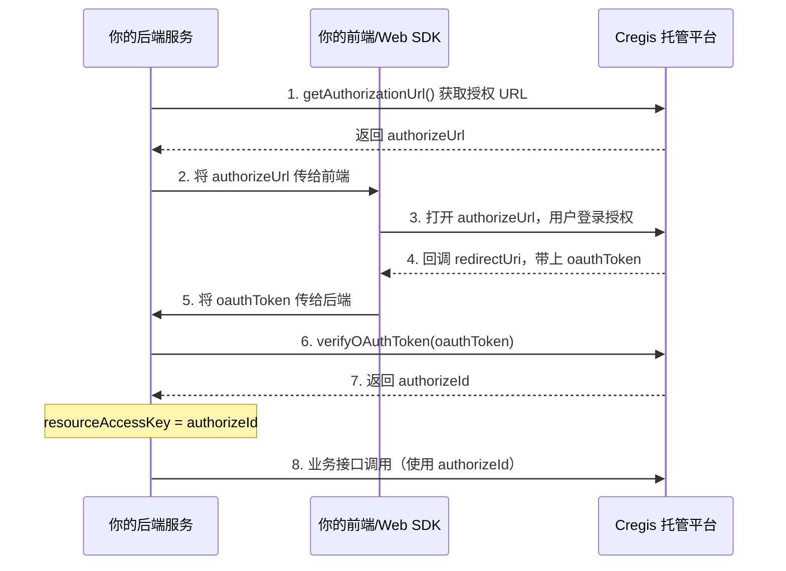

# Cregis OpenPlatform Node.js SDK

Cregis 托管平台 Node.js SDK，用于后端集成加密资产托管服务。

**一句话定位：** 让你的后端系统安全、便捷地接入 Cregis 托管平台，无需关心签名计算、请求构造等底层细节。

**核心能力：**

- 为你的用户创建和管理加密资产托管钱包
- 发起和审批加密资产转账
- 查询交易记录和资金流水
- 管理 Webhook 接收平台通知

**技术特性：**

- TypeScript 原生支持，提供完整类型定义
- 自动签名计算（Basic Signature + Resource Signature）
- 统一的错误处理（SDKError）
- 支持 Node.js 18+

---

## 安装

```bash
npm install @cregis-kit/openplatform-node
```

**要求：** Node.js >= 18.0.0

---

## 快速开始

### 第一步：在开发者门户注册应用

在 Cregis 开发者门户注册应用后，获取以下凭证：

- `appId` — 应用唯一标识（UUID 格式）
- `appSecret` — 应用密钥

### 第二步：安装并初始化 SDK

```typescript
import { CregisSDK } from '@cregis-kit/openplatform-node';

// 初始化 SDK（在开发者门户注册应用后获取 appId 和 appSecret）
const sdk = new CregisSDK({
  baseUrl: 'https://api.cregis.com',
  appId: 'your-app-id-uuid',
  appSecret: 'your-app-secret',
});

// 获取授权 URL
const { authorizeUrl } = await sdk.getAuthorizationUrl({
  permissions: ['treasury:create', 'payout:create'],
  redirectUri: 'https://your-app.com/callback',
  state: 'random-state-string',
});

console.log('打开此 URL 进行授权:', authorizeUrl);
```

---

## 认证流程

SDK 使用 OAuth 2.0 授权流程。`resourceAccessKey` 参数即 `verifyOAuthToken()` 返回的 `authorizeId`。



> **注意：** 步骤 2-5 需要配合 Web SDK 完成授权页面的展示。

### 获取 authorizeId

```typescript
// 前端回调后，将 oauthToken 传给后端
const oauthToken = req.query.oauthToken as string; // 从回调 URL 获取

// 调用 verifyOAuthToken 获取 authorizeId
const { authorizeId } = await sdk.verifyOAuthToken(oauthToken);

// authorizeId 即后续所有业务接口的 resourceAccessKey
console.log('授权成功，authorizeId:', authorizeId);
```

---

## API Reference

### 初始化

```typescript
const sdk = new CregisSDK(config: SDKConfig)
```

| 参数 | 类型 | 必填 | 说明 |
|------|------|------|------|
| `baseUrl` | `string` | 是 | API 基础地址，如 `https://api.cregis.com` |
| `appId` | `string` | 是 | 应用 ID，必须是有效的 UUID 格式 |
| `appSecret` | `string` | 是 | 应用密钥 |
| `timeout` | `number` | 否 | 请求超时时间（毫秒），默认 30000 |
| `debug` | `boolean` | 否 | 调试模式，默认 false |

---

### OAuth / 授权

#### `getAuthorizationUrl`

获取授权 URL，用于发起 OAuth 授权流程。

```typescript
const result = await sdk.getAuthorizationUrl({
  permissions: string[],
  redirectUri: string,
  state: string,
}): Promise<{ authorizeUrl: string; expiresIn: number }>
```

| 参数 | 类型 | 必填 | 说明 |
|------|------|------|------|
| `permissions` | `string[]` | 是 | 请求的权限列表，如 `['treasury:create', 'payout:create']` |
| `redirectUri` | `string` | 是 | 授权完成后的回调地址 |
| `state` | `string` | 是 | 随机字符串，用于 CSRF 防护 |

**返回值：**

| 字段 | 类型 | 说明 |
|------|------|------|
| `authorizeUrl` | `string` | 授权页面 URL |
| `expiresIn` | `number` | URL 有效期（秒） |

---

#### `verifyOAuthToken`

验证 OAuth token，获取 `authorizeId`（即后续业务接口的 `resourceAccessKey`）。

```typescript
const result = await sdk.verifyOAuthToken(oauthToken: string): Promise<{ authorizeId: string }>
```

| 参数 | 类型 | 必填 | 说明 |
|------|------|------|------|
| `oauthToken` | `string` | 是 | 从授权回调获取的 token |

**返回值：**

| 字段 | 类型 | 说明 |
|------|------|------|
| `authorizeId` | `string` | 授权 ID，用于后续所有业务接口 |

---

### 财务单元管理

#### `createTreasuryUnit`

创建财务单元（托管钱包）。

```typescript
const result = await sdk.createTreasuryUnit(
  resourceAccessKey: string, // 即 verifyOAuthToken 返回的 authorizeId
  request: CreateTreasuryUnitRequest
): Promise<CreateTreasuryUnitResponse>
```

| 参数 | 类型 | 必填 | 说明 |
|------|------|------|------|
| `resourceAccessKey` | `string` | 是 | 授权 ID，来自 `verifyOAuthToken` 返回的 `authorizeId` |
| `request.businessScope` | `string` | 是 | 业务模式：`DEDICATED_ACCOUNT` / `OMNIBUS_ACCOUNT` / `OPEN_API_PROXY` |
| `request.topology` | `string` | 是 | 拓扑结构：`ORBIT` / `SINGLE_GENERAL` / `QUAD_SMART_ISOLATION` |
| `request.coinIds` | `Array` | 是 | 支持的币种，如 `[{ coinId: 'BTC', network: 'BTC' }]` |
| `request.primaryManager` | `Array` | 是 | 主账户管理员配置 |
| `request.payoutManager` | `Array` | 是 | 出金管理员配置 |
| `request.riskManager` | `Array` | 是 | 风控管理员配置 |

**返回值：**

| 字段 | 类型 | 说明 |
|------|------|------|
| `id` | `number` | 财务单元 ID |
| `ecode` | `string` | 财务单元编码 |
| `name` | `string` | 财务单元名称 |
| `status` | `string` | 状态 |
| `networks` | `string[]` | 支持的网络 |
| `createTime` | `string` | 创建时间 |

---

#### `listTreasuryUnits`

查询财务单元列表。

```typescript
const result = await sdk.listTreasuryUnits(
  resourceAccessKey: string,
  options?: { pageSize?: number; pageNum?: number; sortFields?: string }
): Promise<TreasuryUnit[]>
```

| 参数 | 类型 | 必填 | 说明 |
|------|------|------|------|
| `resourceAccessKey` | `string` | 是 | 授权 ID |
| `options.pageSize` | `number` | 否 | 每页数量，默认 10 |
| `options.pageNum` | `number` | 否 | 页码，默认 1 |
| `options.sortFields` | `string` | 否 | 排序字段 |

---

#### `getTreasuryUnitAddress`

获取财务单元的地址列表。

```typescript
const result = await sdk.getTreasuryUnitAddress(
  resourceAccessKey: string,
  request: {
    unitId: number;
    accountType?: string;
    coinId?: string;
    network?: string;
    pageSize?: number;
    pageNum?: number;
  }
): Promise<Array<{ address: string; accountType: string }>>
```

| 参数 | 类型 | 必填 | 说明 |
|------|------|------|------|
| `resourceAccessKey` | `string` | 是 | 授权 ID |
| `request.unitId` | `number` | 是 | 财务单元 ID，来自 `createTreasuryUnit` 返回的 `id` |
| `request.accountType` | `string` | 否 | 账户类型 |
| `request.coinId` | `string` | 否 | 币种 ID |
| `request.network` | `string` | 否 | 网络 |
| `request.pageSize` | `number` | 否 | 每页数量 |
| `request.pageNum` | `number` | 否 | 页码 |

---

### 出金操作

#### `createPayout`

创建出金订单（提币/转账）。

```typescript
const result = await sdk.createPayout(
  resourceAccessKey: string,
  request: {
    unitId: number;
    payTo: Array<{ address: string; amount: string }>;
    coinId: string;
    network: string;
    operation?: 'withdraw' | 'allocate' | 'payout';
    orderId?: string;
    merchantType: string;
  }
): Promise<{ orderId: string; unitId: number; status: string }>
```

| 参数 | 类型 | 必填 | 说明 |
|------|------|------|------|
| `resourceAccessKey` | `string` | 是 | 授权 ID |
| `request.unitId` | `number` | 是 | 财务单元 ID，来自 `createTreasuryUnit` 返回的 `id` |
| `request.payTo` | `Array` | 是 | 收款地址和金额列表 |
| `request.payTo[].address` | `string` | 是 | 收款地址 |
| `request.payTo[].amount` | `string` | 是 | 金额（字符串格式，防止精度丢失） |
| `request.coinId` | `string` | 是 | 币种 ID，如 `BTC`、`USDT` |
| `request.network` | `string` | 是 | 网络，如 `BTC`、`Ethereum` |
| `request.operation` | `string` | 否 | 操作类型：`withdraw`（提币）/ `allocate`（归集）/ `payout`（支付），默认 `withdraw` |
| `request.orderId` | `string` | 否 | 商户订单号 |
| `request.merchantType` | `string` | 是 | 商户类型 |

**返回值：**

| 字段 | 类型 | 说明 |
|------|------|------|
| `orderId` | `string` | 平台订单号 |
| `unitId` | `number` | 财务单元 ID |
| `status` | `string` | 订单状态 |

---

#### `listTransferOutOrders`

查询出金订单列表。

```typescript
const result = await sdk.listTransferOutOrders(
  resourceAccessKey: string,
  options?: {
    pageIndex?: number;
    pageSize?: number;
    sortFields?: string;
    queryList?: Array<{ key: string; value: string | number; oper?: string; join?: string }>;
  }
): Promise<{
  list: Array<{
    id: number; orderId: string; unitId: number; unitEcode: string;
    coinId: string; network: string; amount: string; fee: string;
    status: string; fromAddress: string; toAddress: string;
    txHash?: string; createdAt: string; updatedAt?: string;
  }>;
  total: number; pageIndex: number; pageSize: number;
}>
```

---

#### `listTransferInOrders`

查询入金订单列表。参数和返回值与 `listTransferOutOrders` 结构相同。

```typescript
const result = await sdk.listTransferInOrders(
  resourceAccessKey: string,
  options?: { ... }
): Promise<PaginatedOrders>
```

---

### 任务审批

#### `submitTask`

提交任务审批（确认/拒绝）。

```typescript
const result = await sdk.submitTask(
  resourceAccessKey: string,
  taskId: string,
  request: { signatures?: Record<string, string[]>; confirmed: boolean }
): Promise<{ success: boolean; taskId: string; status: string }>
```

| 参数 | 类型 | 必填 | 说明 |
|------|------|------|------|
| `resourceAccessKey` | `string` | 是 | 授权 ID |
| `taskId` | `string` | 是 | 任务 ID |
| `request.signatures` | `Record` | 否 | 签名信息 |
| `request.confirmed` | `boolean` | 是 | 是否确认：`true`（确认）/ `false`（拒绝） |

---

### 交易记录

#### `listActivities`

查询活动记录（实时变动）。

```typescript
const result = await sdk.listActivities(
  resourceAccessKey: string,
  options?: {
    pageIndex?: number;
    pageSize?: number;
    sortFields?: string;
    queryList?: QueryCondition[];
  }
): Promise<{
  list: Array<{
    id: number; activityId: string; unitId: number; unitEcode: string;
    coinId: string; network: string; type: string; direction: 'IN' | 'OUT';
    amount: string; balanceBefore: string; balanceAfter: string;
    fee?: string; txHash?: string; fromAddress?: string; toAddress?: string;
    status: string; createdAt: string;
  }>;
  total: number; pageIndex: number; pageSize: number;
}>
```

---

#### `listFundRecords`

查询资金流水记录。

```typescript
const result = await sdk.listFundRecords(
  resourceAccessKey: string,
  options?: {
    pageIndex?: number;
    pageSize?: number;
    sortFields?: string;
    queryList?: QueryCondition[];
  }
): Promise<{
  list: Array<{
    id: number; recordId: string; unitId: number; unitEcode: string;
    coinId: string; network: string; accountType: string; txType: string;
    amount: string; balanceBefore: string; balanceAfter: string;
    fee?: string; txHash?: string; fromAddress?: string; toAddress?: string;
    createdAt: string;
  }>;
  total: number; pageIndex: number; pageSize: number;
}>
```

---

### Webhook 管理

#### `registerWebhook`

注册 Webhook，用于接收平台事件通知。

```typescript
const result = await sdk.registerWebhook({
  url: string;
  eventTypes: string[];
}): Promise<{
  id: string;
  url: string;
  eventTypes: string[];
  isActive: boolean;
  secret: string;
}>
```

| 参数 | 类型 | 必填 | 说明 |
|------|------|------|------|
| `url` | `string` | 是 | Webhook 接收地址（必须是 HTTPS） |
| `eventTypes` | `string[]` | 是 | 订阅的事件类型，如 `['payout.completed', 'payout.failed']` |

**返回值：**

| 字段 | 类型 | 说明 |
|------|------|------|
| `id` | `string` | Webhook ID |
| `secret` | `string` | 签名密钥，用于验证请求来源 |

---

#### `listWebhooks`

查询已注册的 Webhook 列表。

```typescript
const result = await sdk.listWebhooks(): Promise<Array<{
  id: string;
  url: string;
  eventTypes: string[];
  isActive: boolean;
}>>
```

---

#### `deleteWebhook`

删除 Webhook。

```typescript
const result = await sdk.deleteWebhook(id: string): Promise<{ success: boolean }>
```

---

### 工具方法

#### `getConfig`

获取当前配置（不包含敏感信息）。

```typescript
const config = sdk.getConfig(): Pick<SDKConfig, 'baseUrl' | 'appId' | 'timeout' | 'debug'>
```

---

## 错误处理

SDK 所有错误都封装为 `SDKError` 类型。

### SDK 错误码（本地错误）

| 错误码 | 说明 | 是否可重试 |
|--------|------|------------|
| `CONFIG_MISSING_BASE_URL` | 缺少 baseUrl 配置 | 否 |
| `CONFIG_MISSING_APP_ID` | 缺少 appId 配置 | 否 |
| `CONFIG_MISSING_APP_SECRET` | 缺少 appSecret 配置 | 否 |
| `CONFIG_INVALID_APP_ID` | appId 格式无效（必须是 UUID） | 否 |
| `TOKEN_NOT_FOUND` | Token 未找到 | 否 |
| `TOKEN_EXPIRED` | Token 已过期 | 是 |
| `TOKEN_REFRESH_FAILED` | Token 刷新失败 | 是 |
| `SIGNATURE_INVALID` | 签名无效 | 否 |
| `SIGNATURE_TIMESTAMP_INVALID` | 时间戳无效或过期 | 否 |
| `SIGNATURE_NONCE_MISSING` | 缺少 nonce | 否 |
| `HTTP_REQUEST_FAILED` | HTTP 请求失败 | 是 |
| `HTTP_TIMEOUT` | 请求超时 | 是 |
| `HTTP_NETWORK_ERROR` | 网络错误 | 是 |
| `VALIDATION_ERROR` | 验证错误 | 否 |
| `VALIDATION_MISSING_REQUIRED` | 缺少必填字段 | 否 |
| `VALIDATION_INVALID_FORMAT` | 字段格式无效 | 否 |

### API 错误码（服务端返回）

| 错误码 | 说明 | 是否可重试 |
|--------|------|------------|
| `API_ERROR` | API 请求失败 | 是 |
| `API_UNAUTHORIZED` | 认证失败 | 否 |
| `API_FORBIDDEN` | 访问被拒绝 | 否 |
| `API_NOT_FOUND` | 资源未找到 | 否 |
| `API_CONFLICT` | 资源冲突 | 否 |
| `API_RATE_LIMITED` | 请求频率超限 | 是 |
| `API_SERVER_ERROR` | 服务器错误 | 是 |

### 错误处理示例

```typescript
import { CregisSDK, SDKError, SDKErrorCode } from '@cregis-kit/openplatform-node';

const sdk = new CregisSDK({ ... });

try {
  const result = await sdk.createTreasuryUnit(resourceAccessKey, request);
} catch (error) {
  if (error instanceof SDKError) {
    console.error('SDK Error:', {
      code: error.code,
      message: error.message,
      httpStatus: error.httpStatus,
      isRetryable: error.isRetryable,
    });

    // 根据错误类型处理
    if (error.code === SDKErrorCode.API_UNAUTHORIZED) {
      // 认证失败，需要重新获取授权
      console.log('需要重新授权');
    } else if (error.isRetryable) {
      // 可重试错误，稍后重试
      console.log('稍后重试');
    }
  } else {
    // 非 SDK 错误
    console.error('Unexpected error:', error);
  }
}
```

### 常见错误排查

**1. `CONFIG_INVALID_APP_ID`**
> appId 必须是有效的 UUID 格式。检查开发者门户获取的 appId 是否正确。

**2. `API_UNAUTHORIZED`**
> 授权已过期或无效。需要重新调用 `getAuthorizationUrl` 获取新的授权。

**3. `API_RATE_LIMITED`**
> 请求频率超限。SDK 会自动处理重试，但建议在业务层添加限流。

---

## 签名说明

**SDK 自动处理签名，你无需手动计算。**

SDK 内部自动为每个请求计算签名，包括：

- **Basic Signature** — 用于 OAuth 接口（`getAuthorizationUrl`、`verifyOAuthToken`）
- **Resource Signature** — 用于业务接口（所有需要 `resourceAccessKey` 的方法）

<details>
<summary>点击查看签名算法详情</summary>

### Basic Signature（OAuth 接口）

```
signature = MD5(appSecret + appId + timestamp + nonce + MD5(sortedBusinessJSON))
```

### Resource Signature（业务接口）

```
signature = MD5(appSecret + appId + authorizationId + timestamp + nonce + MD5(sortedBusinessJSON))
```

### 请求结构

```json
{
  "basic": {
    "appId": "...",
    "timestamp": 1234567890,
    "nonce": "random-string",
    "signature": "..."
  },
  "business": { ... }
}
```

业务接口额外包含 `authorizationId`：

```json
{
  "basic": {
    "appId": "...",
    "timestamp": 1234567890,
    "nonce": "random-string",
    "signature": "...",
    "authorizationId": "..."
  },
  "business": { ... }
}
```

</details>

---

## TypeScript 类型导出

SDK 提供以下公开导出：

```typescript
import {
  CregisSDK,           // 主类
  SDKConfig,           // 配置类型
  SDKError,            // 错误类
  SDKErrorCode,        // 错误码枚举
  ErrorCodeMessages,   // 错误信息映射
  SignatureType,       // 签名类型枚举
} from '@cregis-kit/openplatform-node';
```

### SDKConfig

```typescript
interface SDKConfig {
  baseUrl: string;
  appId: string;
  appSecret: string;
  timeout?: number;
  debug?: boolean;
}
```

### SDKError

```typescript
class SDKError extends Error {
  code: SDKErrorCode | number;
  message: string;
  httpStatus?: number;
  details?: Record<string, unknown>;
  isRetryable: boolean;
}
```

---

## 许可证

MIT License
